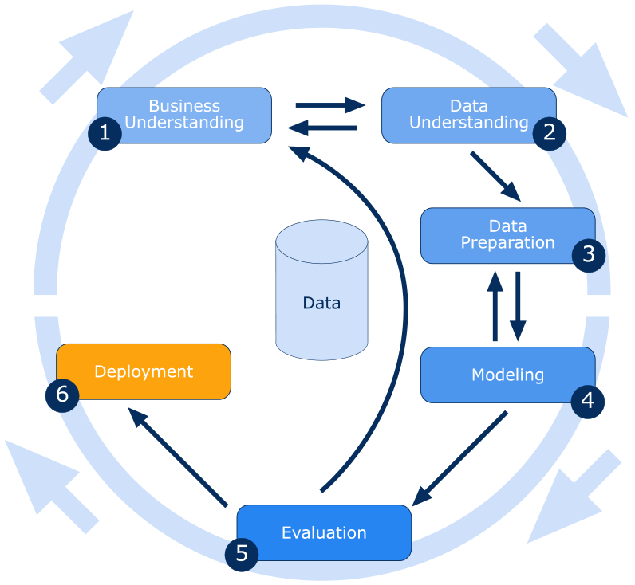
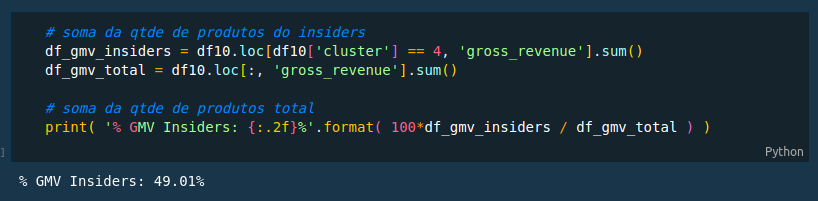
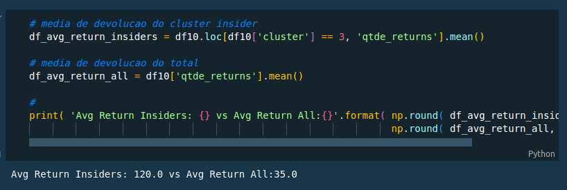
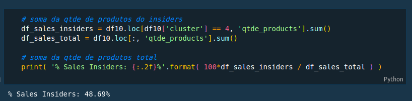

Loyaty Program | Custering
==============================

## 1. Problema de Negócio

A empresa é um Outlet multimarcas, ou seja ela comercializa produtos de segunda linha de várias marcas a um preço menor, através de um e-commerce.

Em 1 ano de operação, o time de marketing percebeu que alguns clientes da base, compram produtos mais caros, com alta frequência e que eles representam uma parte significativa do faturamento da empresa.

Foi decidido pela criação de um programa de fidelidade para os melhores clientes (Insiders). O time de marketing precisa saber quem são estes clientes.

> Você é cientista de dados. Após a reunião mensal foi decidido que você, como Cientista de Dados, está encarregado de determinar quais são os clientes elegíveis para participar do Insiders. Com esta lista o time de Marketing fará campanhas personalizadas e exclusivas ao grup, para aumentar o faturamento e fequeência de compra.

| Problema | Causa Raiz | Questão principal |
| --- | --- | --- |
| Criar programa de fidelidade | Incrementar o faturamento | Quem são os clientes de alto valor? |

## 2. Suposições de Negócio
- Considerei quantidades menores a 0 como devoluções de uma compra.
- Valores da  variável "stock_code" não exclusivamente numéricas serão excluidos, já que não há suficiente informção para saber do que se tratam .
- Aproximadamente 25% das transações não possuem um "customer_id". Foi criado um valor artificial para estas transações. É possível que alguns comportamentos de compra sejam perdidos.
 

## 3. Desenvolvimento da Solução
### 3.1. Produto Final
- Um reporte em csv com a lista dos clientes selecionados.
- Algoritmo treinado disponível na AWS para futuras clusterizações

### 3.2. Ferramentas
- Python, VS Code
- EC2, S3, RDS AWS
- Metabase
- Git, Github

### 3.3. Processo
O processo de solução do projeto é baseado na metodologia CRISP-DM, que é a sigla apra Cross Industry Process - Data Mining. É uma metodologia ágil que fornece uma estrutura robusta para planejamento de projetos de Machine Learning. Funciona como um processo cíclico, focado em entrega incremental a cada novo ciclo.

* **Passo 01:** Descrição dos Dados: limpeza e descrição estatistica dos dados, afim de encontrar erros e comportamentos incomuns.
* **Passo 02:** Feature engineering: derivação de novas features, para modelar melhor o fenômeno.
* **Passo 03:** Filtragem de variáveis: remover linhas e colunas não necessárias para o modelo.
* **Passo 04:** Análise Exploratória de Dados: validação de hipóteses, busca por insights e entender melhor o impacto das variáveis no fenômeno.
* **Passo 05:** Preparação dos Dados: adequação dos dados para que o modelo de Machine Learning possa aprender corretamente.
* **Passo 06:** Seleção de Variáveis: selecionar as features mais significantes para treinar o modelo.
* **Passo 07:** Modelagem do Modelo: testar diferentes algoritmos de Machine Learning e comparar os resultados, afim de escolher um que perfome melhor para o conjunto de dados.
* **Passo 08:** Fine Tunnig: escolher os melhores valores para os hiperparâmetros do modelo selecionado anteriormente.
* **Passo 09:** Avaliação e Interpretação do Erro: converter o a performance do modelo de Machine Learnig em resultados de negócio.
* **Passo 10:** Deploy do model em produçãp: publicar o modelo em um ambiente de nuvem para que os envolvidos no projeto consigam acessar os resultados e melhorar suas decições de negócio.
    
# 4. Coleta de Dados

- **Dataset está disponível no repositório da University of Califoria: [clique aqui](https://archive.ics.uci.edu/dataset/352/online+retail)**
    
Este é um conjunto de dados transnacionais que contém todas as transações ocorridas entre 01/12/2010 e 09/12/2011 para um varejo on-line localizado no Reino Unido.
    
    
## 5. Top 3 Insights

### 5.1. Insights

Algumas hipóteses de negócio foram levantadas, para serem validadas ou não. No total foram levantadas 12 hipóteses, e dentro delas aqui estão os 3 top insights retirados da análise de dados e validação das hipoteses.

| **Insight 01 - Insiders faturam 10% acima do restante da base** |
| --- |
|  |

| **Insight 02 - Grupo Insiders tem a média de devolução menor que a base total** |
| --- |
|  | 

| **Insight 03 - Insiders tem volume de compra (produtos) maior que a base total** | 
| --- |
|  | 

# 6. Feature Engineering

Com o conjunto de dados original não é possível encontrar um comportamento de compra, ao ponto de conseguir separar os clusters. Para resolver isso, derivei algums features do conjunto de dados orignial, agrupando todas por "customer_id" único. São elas:

['customer_id', 'gross_revenue', 'recency_days', 'qtde_invoices', 'qtde_items', 'qtde_products', 'avg_ticket', 'avg_recency_days', 'frequency', 'qtde_returns', 'avg_basket_size', 'avg_unique_basket_size', 'revenue_returned']

# 7. Hyperparameter Fine-Tuning

Depois de modelar os dados usando as técnicas de encoding e nature transformation, o Boruta foi usado para selecionar as melhores features para o modelo. Aqui está a seleção das features mais relevantes para o modelo:

['store','promo','store_type','assortment','competition_distance','competition_open_since_month','competition_open_since_year','promo2','promo2_since_week','promo2_since_year','competition_time_month','promo_time_week','day_of_week_sin','day_of_week_cos','month_sin','month_cos','day_sin','day_cos','week_of_year_sin','week_of_year_cos'']

Em total, foram testados e comparados 5 modelos:
* Média
* Regressão Linear
* Regressão Linear Regularizada
* Random Forest
* XGBoost

Para encontrar a real performance, foi usada a técnica de cross validation para séries temporáis, já que tempo é uma variável importante no nosso problema. Para isso, apenas as últimas 6 semanas foram separadas para test, e o resto dos dados foi separado em 5 partes para serem usados para treino e teste de forma que não fossem usados dados futuros para as previsões.

Após o cross validation, essas são as performances reais dos modelos:

A média de vendas foi usada como medida de base para previsão. Isso nos permite ter um valor base para comprar outros modelos mais complexos. Como pode ser visto, os modelos lineares tiveram uma performance inferior à média. Isso mostra que o fenômeno que buscamos modelar aqui é complexo e não linear.
Uma observação deve ser feira. Apesar de a Random Forest ter performado melhor, o modelo escolhido foi o XGBoost. A razão para isso é que o modelo gerado pela Random Forest pode ser muito grande, ocupando muito espaço em memória, gerando problemas no momento do deploy.

# 6. Modelo de Machine Learnig Aplicado

Depois de modelar os dados usando as técnicas de encoding e nature transformation, o Boruta foi usado para selecionar as melhores features para o modelo. Aqui está a seleção das features mais relevantes para o modelo:

['store','promo','store_type','assortment','competition_distance','competition_open_since_month','competition_open_since_year','promo2','promo2_since_week','promo2_since_year','competition_time_month','promo_time_week','day_of_week_sin','day_of_week_cos','month_sin','month_cos','day_sin','day_cos','week_of_year_sin','week_of_year_cos'']

Em total, foram testados e comparados 5 modelos:
* Média
* Regressão Linear
* Regressão Linear Regularizada
* Random Forest
* XGBoost

Para encontrar a real performance, foi usada a técnica de cross validation para séries temporáis, já que tempo é uma variável importante no nosso problema. Para isso, apenas as últimas 6 semanas foram separadas para test, e o resto dos dados foi separado em 5 partes para serem usados para treino e teste de forma que não fossem usados dados futuros para as previsões.

Após o cross validation, essas são as performances reais dos modelos:

A média de vendas foi usada como medida de base para previsão. Isso nos permite ter um valor base para comprar outros modelos mais complexos. Como pode ser visto, os modelos lineares tiveram uma performance inferior à média. Isso mostra que o fenômeno que buscamos modelar aqui é complexo e não linear.
Uma observação deve ser feira. Apesar de a Random Forest ter performado melhor, o modelo escolhido foi o XGBoost. A razão para isso é que o modelo gerado pela Random Forest pode ser muito grande, ocupando muito espaço em memória, gerando problemas no momento do deploy.

# 7. Performance do Modelo & Fine Tunnig

Para encontrar os melhores parâmetros para treinar o modelo escolhido, foi usada uma Random Forest. Em futuros ciclos do CRISP-DM novos hiperparâmetros podem ser testados, para melhorar ainda mais a performance do modelo de Machine Learning. Após o modelo XGBoost ser treinado novamente com os hiperparâmetros encontrados, consegui chegar a performance final do modelo.

# 8. Deployment

Neste ponto o modelo já está pronto para ir para produção e ser disponibilizado para o usuário final. O forma como este produto será entregue é um bot no telegram, onde o usuário insere o número de loja, e recebe as previsões de vendas para as próximas 6 semanas somadas.

Aqui você pode ver o funcionamento da API:

# 9. Resultados de Negócio

Uma parte importante de qualquer projeto de Data Science é traduzir os perfomance em resultados reais de negócio. Para este projeto, MAE (Mean Absolute Error), foi a métrica escolhida para explicar em valores reais a performance do modelo de Machine Learning. As previsões têm uma margem de erro, para mais ou para menos. 

Segue abaixo uma tablea, levando em consideração a margem de erro do modelo, apresentando assim o melhor e pior cenário da previsão de vendas.

# 10. Conclusão

Após analizar os resultados conseguidos com o algorítmo, fica claro que o XGBoost é muito mais preciso em relação ao modelo que era usado anteriormente. O fenômeno que analisei neste projeto é complexo, envolvendo vários fatores que afetam as vendas. Foi necessário adaptar todo o projeto para este problema de série temporal.

Algumas lojas, como pode ser viso to gráfico abaixo, são mais dificeis para fazer a predição. Seria necessário um outro projeto dedicado somente ao tratamento destes outliers. Um novo ciclo do CRISP-DM poderia ser dedicado a isso.

Aqui vemos a soma da predição de todas as lojas nas próximas 6 semana. Isso dá ao CFO uma visão muito mais clara que quanto dinheiro ele tem diponível para investir na expansão das lojas, dando mais segurança se for preciso recorrer a empréstimos bancários para dar inicio as obras.

# 11. Próximos passos

- Procure dados externos como clima, eventos nacionais, indicadores macroeconomicos, entre outros.
- Derivar novas features no processo de feature engineering.
- Experimente o método de busca bayesiana na etapa de fine tunnig.
- Adicionar gráfico e tabelas ao bot do telegram.
